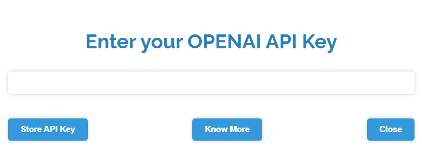
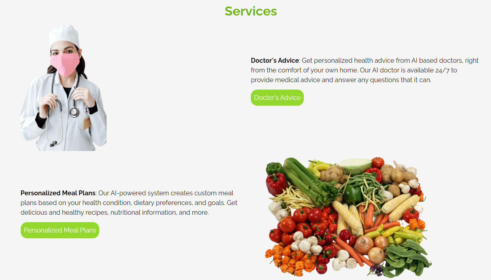
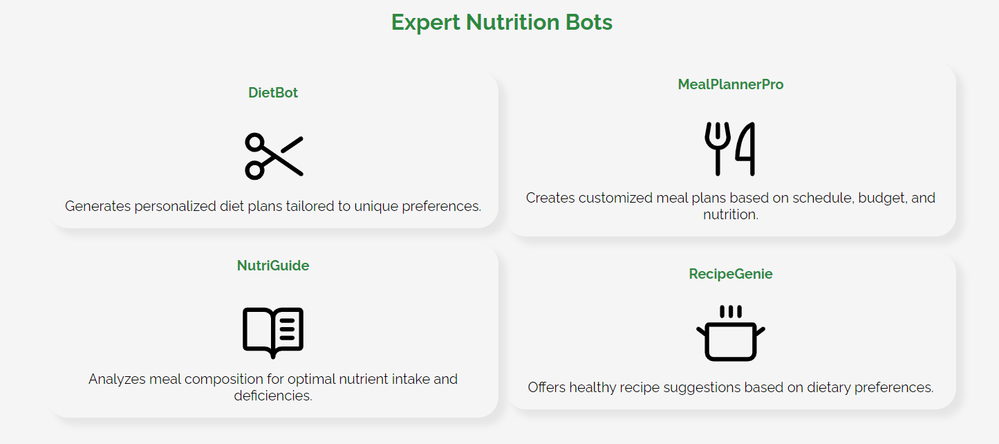
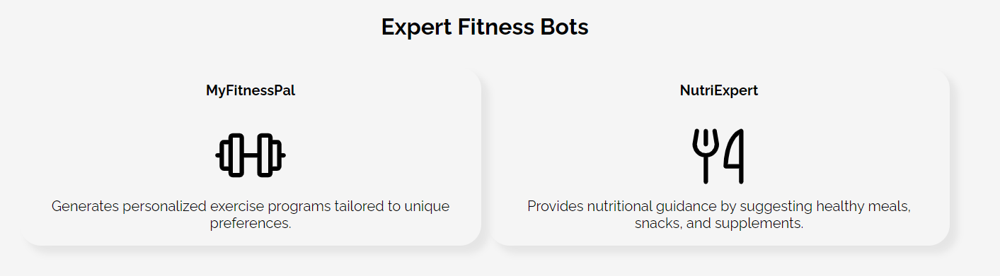

# HealthHealer.ai
Welcome to HealthHealer.ai - Your all-in-one Healthcare platform powered by Artificial Intelligence!

### Overview
The website is built using HTML, CSS, and JavaScript. Website is broadly divided into four main sections, including Doctor Advice's Section, Personalized Diet Plans Section, Medicine Information Section, and Workout and Nutrition Plans Section.Each Section consist of ChatBot which are powered by OPENAI API that generate results corresponding to User's need.

### DEMO Video
https://www.youtube.com/watch?v=FBj1WRb7LZw

**Note**: The website is designed to run on wide screens, and is not be suitable for smaller screens.

### Installation
To run the website, you need to clone the repository into your machine and run the index.html file.Make sure you are using the updated version of the browser, otherwise some of the functionalities would not work.

### Usage
Website is broadly divided in **4** parts:
1. Docter's Advice
* Primary Care Department
* Cardiology Department
* Dermatology Department
* Gastroentrology Department
* Obstetrics and Gynecology Department
* **More Sections coming soon...**
2. Personalized Meal Plans
* DietBot: Generates personalized diet plans tailored to unique preferences
* MealPlannerPro: Creates customized meal plans based on schedule,budget,nutrition and much more
* NutriGuide: Analyzes meal composition for optimal nutrient intake and deficiencies
3. Medicine Information
4. Workout and Exercise
* MyFitnessPal: Generates personalized exercise programs tailored to unique preferences
* NutriExpert: Provides nutritional guidance by suggesting healthy meals, snacks, and supplements

User will interact with ChatBots and will get results as per their preferences.

#### Steps to Navigate through Website

1. When user will first time open the website, he/she will see a message like this:

Don't get panic Just enter your OPENAI API Key in the input field and click on **Store API Key**.If you don't know how to generate your Own OPENAI API Key,then click on **know more** button or watch this youtube tutorial https://www.youtube.com/watch?v=TE3rFhg0RdQ or visit OPENAI Website using this link https://platform.openai.com/account/api-keys.

**Note** Once you generated your API key,Store it in safe place as once you copied it, you will not get chance to get it again. If you lost the key, then click on **Change API Key** Option in the website to update the new generated API Key. If you find any difficulty, feel free to contact us.

2. Then you are free to navigate through each section of the website. You can track your OPENAI API Key usage through this link https://platform.openai.com/account/usage 

3. If you have any query or facing any issue, feet free to Contact Us using Contact Us section of the website, or by sending an email to dhillonjaskaran4486@gmail.com.

### Some Website ScreenShots

